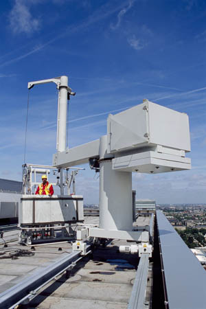

# bmu

> A building maintenance unit (BMU) is an automatic, remote-controlled, or
> mechanical device, usually suspended from the roof, which moves
> systematically over some surface of a structure while carrying human window
> washers or mechanical robots to maintain or clean the covered surfaces.

Also, a little Flask server modelled on [Homu](https://github.com/barosl/homu)
to trigger Buildbot builds and report statuses to GitHub.
